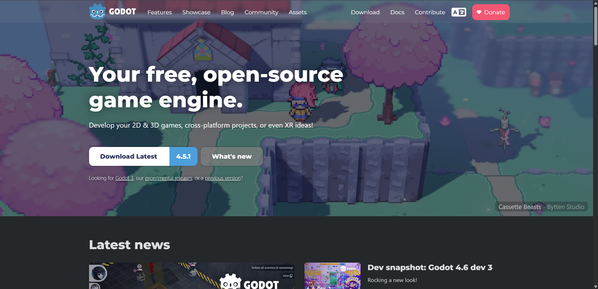
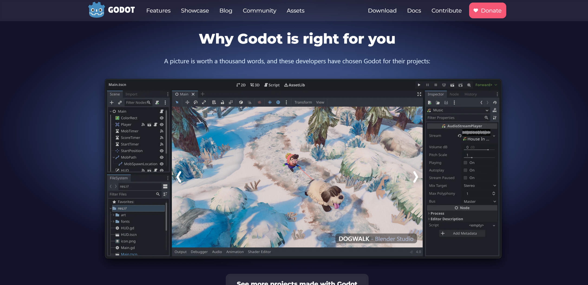
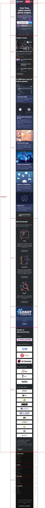
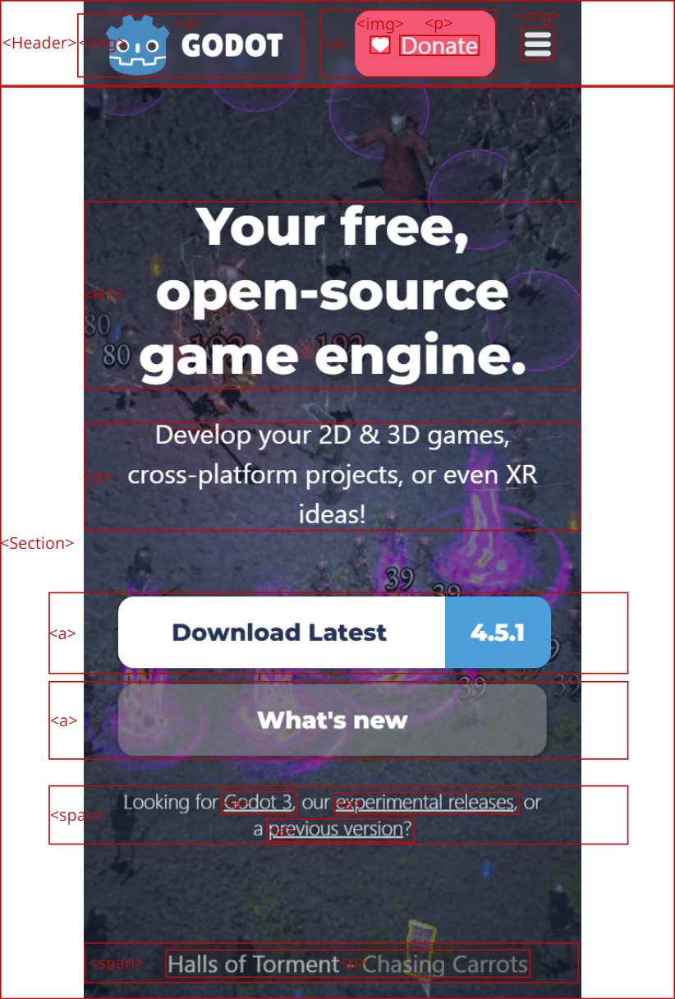
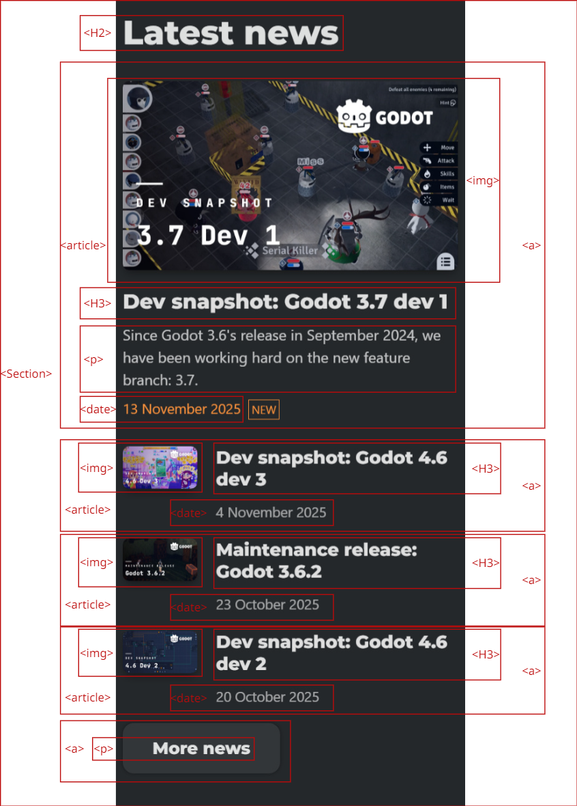
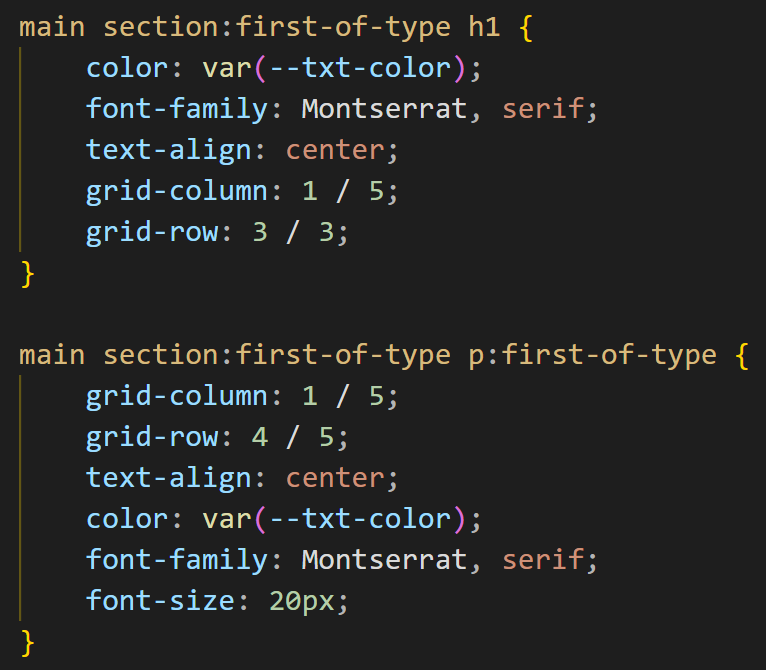

# Procesverslag

Markdown is een simpele manier om HTML te schrijven.  
Markdown cheat cheet: [Hulp bij het schrijven van Markdown](https://github.com/adam-p/markdown-here/wiki/Markdown-Cheatsheet).

Nb. De standaardstructuur en de spartaanse opmaak van de README.md zijn helemaal prima. Het gaat om de inhoud van je procesverslag. Besteedt de tijd voor pracht en praal aan je website.

Nb. Door _open_ toe te voegen aan een _details_ element kun je deze standaard open zetten. Fijn om dat steeds voor de relevante stuk(ken) te doen.

## Jij

  
uitwerken voor kick-off werkgroep

### Auteur:

Ronald Lommers

#### Je startniveau:

Rode Piste

#### Je focus:

Responsive Design

## Je website

  
uitwerken voor kick-off werkgroep

### Je opdracht:

link naar de website die je gaat namaken óf de naam/omschrijving van je eigen ontwerp
https://godotengine.org/

#### Screenshot(s) van de eerste pagina (small screen):

Homepage

#### Screenshot(s) van de tweede pagina (small screen):

Features  
 

## Toegankelijkheidstest 1/2 (week 1)

  
uitwerken na test in 2e werkgroep

### Bevindingen

Lijst met je bevindingen die in de test naar voren kwamen:

Screen Reader:

Algemeen:
De godot website maakt gebruik van verschillende kopjes
De website maakt gebruik van verschillende headings (H1 t/m H4)

Header:
Geeft in de header eerst duidelijk aan dat het in de header is en vervolgens dat het een link is

Begin:
Geeft duidelijk H1 aan
Geeft duidelijk alle links aan
Geen alt tekst voor het achtergrond plaatje

Latest News:
Geen alt tekst bij de afbeeldingen
Als een volledig blok geselecteerd word zegt het alleen "LINK" voor de rest niets

Goed:
Over het algemeen word en goed gebruik gemaakt van kopjes
In de header word duidelijk aangegeven dat de gebruiker zich in de header bevind en vervolgens word aangegeven dat het een link is en wat er staat

Slecht:
Er word over het algemeen geen gebruik gemaakt van alt tekst voor afbeeldingen waardoor volledig visueel beperkte geen idee hebben wat de afbeelding is
Bij news blokken word alleen het woord "LINK" gezegd voor de rest niets tenzij de rest apart word geselecteerd

WCAG Test Summary:

Goed:
De website maakt gebruik van duidelijke taal
Op de pagina's word er gebruik gemaakt van 1 H1
Er word gebruik gemaakt van de Lang attribute in de html
Er kan worden ingezoomd
De website is duidelijk en gemakkelijk te navigeren met en keyboard
De website kan horizontaal op mobiel en ipad worden bekeken
Horizontaal scrollen is uitgeschakkeld
Knoppen en link iconen zijn groot genoeg en goed gepositioneerd
Er word gebruik gemaakt van heading elementen om de content te introduceren
De heading elementen worden in een logische volgorde geschreven
Er word geen heading level overgeslagen
De decoratieve foto's bevatten geen alt tekst
Het A elementen word gebruikt voor links
Klikbare elementen hebben een focus state
Hight contrast mode word ondersteund

Slecht:
De homepage heeft geen titel waardoor dat niet te lezen is door screen readers
Bij het valideren van de HTML kwamen er 4 errors en 3 waarschuwingen aan het licht
De ruimte tussen bepaalde interactieve elementen is te weinig
Er word bijna overal gebruik gemaakt van DIV's in plaats van OL, UL of DL elementen
Bij geen van de foto's op de website word alt tekst gebruikt
Veel links zien eruit als knoppen
Niet klikbare elementen hebben ook een focus state
Er is geen skip link aanwezig in de website
Er is geen Light mode

## Breakdownschets (week 1)

  
uitwerken na afloop 3e werkgroep

### de hele pagina:

  

### dynamisch deel (bijv menu):

  

### wellicht nog een dynamisch deel (bijv filter):

  

  

## Voortgang 1 (week 2)

  
uitwerken voor 1e voortgang

### Stand van zaken

hier dit ging goed & dit was lastig (neem ook screenshots op van delen van je website en code)

Ik ben nog niet zo ver als dat ik van te voren gehoopt had, ik kan met een gerust hart zeggen dat ik achter loop. Ik heb mijn vaardigheden met CSS overschat en deze voor mij compleet nieuwe manier van programmeren is voor mij een enorme uitdaging. Wel heb ik aardig wat stappen gemaakt met de HTML, ik heb de volledige HTML uitgeschreven. Ik heb het zo goed gedaan als dat de docent mij de afgelopen 2 weken geleerd heeft.

Dit is de houdige status van mijn website:

Wat ik in de CSS vooral moeilijker vond dan gedacht is het selecteren van elementen zonder gebruik te maken van Classes of ID's. Voor mij is dit compleet nieuw terein, dit heb ik na een uitleg van mijn docent redelijk onder de knie. Nog steeds vind ik dit lastig en best intimiderend omdat het nieuw is maar ik denk dat met meer gebruik ik er binnenkort aan gewend zal zijn.

Wat ik ook lastiger vond dan gedacht is het werken met GRID, in het verleden heb ik hier al eerder mee gewerkt maar ook toen waren GRID en ik nog niet echt buddy's. Het begint langzaam nu wel een klein beetje te komen maar nog steeds struggle ik er wel mee. Iets waar ik tegen aan liep was steeds de row of column template uistrijven, dus met 1fr 1fr 1fr 1fr etc. Het stylde maar niet goed voor een reden, toen ik repeat begon te gebruiken ging het snel al beter bijv repeat(7, auto). Ook gaf ik eerst alleen een GRID start een geen GRID end waardoor het ook een kliederboel werd, na uiteindelijk die te hebben vervangen met grid-row of grid-column ging het ook veel beter. Dit is een snippid van mijn code van hoe het er nu uitziet:

Deze week was om eerlijk te zijn voor mij en klap terug in de realiteit, ik dacht namelijk heel goed te zijn in HTML CSS maar nu kom ik erachter hoe gelimiteerd kwa kennis van zaken ik ben. Dit is te zien aan de vooruitgang die ik heb geboekt, ik ben er niet tevreden mee. Hoe nu verder? Ik zal extra bloed zweet en tranen in het process gaan stoppen, want ik ben er van overtuigt als ik mijn schouders eronder zet ik veel kan leren van dit project.

### Agenda voor meeting

samen met je groepje opstellen

| Tijn           | Ronald                                                                                                                                  | Daniel Post | Iz-Dine       |
| -------------- | --------------------------------------------------------------------------------------------------------------------------------------- | ----------- | ------------- | ----------------------------------------------------------- |
| dit bespreken  | Is de structuur van de Html in orde?                                                                                                    | en ik dit   | en dan ik dat | Wat was uw idee van de download lastest stylen ook al weer? |
| en dat ook nog | Is het acceptabel om een Div te gebruiken om een kleurtje over mijn background image te plaatsen? Zo nee hoe kan ik het dan beter doen? |
| ...            | ...                                                                                                                                     | ...         | ...           |

### Verslag van meeting

hier na afloop snel de uitkomsten van de meeting vastleggen

- punt 1
- punt 2
- nog een punt
- ...

## Voortgang 2 (week 3)

  
uitwerken voor 2e voortgang

### Stand van zaken

hier dit ging goed & dit was lastig (neem ook screenshots op van delen van je website en code)

### Agenda voor meeting

samen met je groepje opstellen

| student 1      | student 2          | student 3    | student 4        |
| -------------- | ------------------ | ------------ | ---------------- |
| dit bespreken  | en dit             | en ik dit    | en dan ik dat    |
| en dat ook nog | dit als er tijd is | nog een punt | dit wil ik zeker |
| ...            | ...                | ...          | ...              |

### Verslag van meeting

hier na afloop snel de uitkomsten van de meeting vastleggen

- punt 1
- punt 2
- nog een punt
- ...

## Toegankelijkheidstest 2/2 (week 4)

  
uitwerken na test in 9e werkgroep

### Bevindingen

Lijst met je bevindingen die in de test naar voren kwamen (geef ook aan wat er verbeterd is):

## Voortgang 3 (week 4)

  
uitwerken voor 3e voortgang

### Stand van zaken

hier dit ging goed & dit was lastig (neem ook screenshots op van delen van je website en code)

### Agenda voor meeting

samen met je groepje opstellen

| student 1      | student 2          | student 3    | student 4        |
| -------------- | ------------------ | ------------ | ---------------- |
| dit bespreken  | en dit             | en ik dit    | en dan ik dat    |
| en dat ook nog | dit als er tijd is | nog een punt | dit wil ik zeker |
| ...            | ...                | ...          | ...              |

### Verslag van meeting

hier na afloop snel de uitkomsten van de meeting vastleggen

- punt 1
- punt 2
- nog een punt
- ...

## Eindgesprek (week 5)

  
uitwerken voor eindgesprek

### Je uitkomst - karakteristiek screenshots:

  

### Dit ging goed/Heb ik geleerd:

Korte omschrijving met plaatjes

  

### Dit was lastig/Is niet gelukt:

Korte omschrijving met plaatjes

  

## Bronnenlijst

  
continu bijhouden terwijl je werkt

Nb. Wees specifiek ('css-tricks' als bron is bijv. niet specifiek genoeg).
Nb. ChatGpT en andere AI horen er ook bij.
Nb. Vermeld de bronnen ook in je code.

1. bron 1
2. bron 2
3. ...

